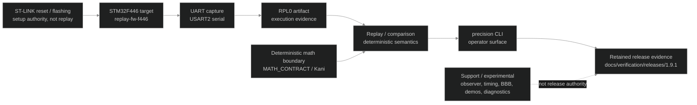

# Precision Signal 2.0 Roadmap

## Project Direction

Precision Signal is a deterministic execution validation system centered on replay, operated through the `precision` CLI against an attached STM32 target over UART.

Precision Signal 2.0 keeps that direction narrow. It focuses on making the replay/evidence workflow understandable, repeatable, and reviewable without broadening the project into a platform, provenance system, security product, field-instrumentation suite, or Trace Authority rebrand.

## Current Foundation: 1.9.1 System Map

The core mental model for the current `1.9.1` foundation:



Support/reference/experimental material includes dual-board observer evidence, timing characterization, BBB orchestration, replay diagnostics, and demo evidence. These may support review, diagnosis, or later roadmap decisions, but they are not current release authority unless explicitly promoted by a later release or roadmap.

## 2.0 Intent

Precision Signal 2.0 promotes the current replay/evidence path from the retained `1.9.1` foundation into a clearer documented release surface.

The intent is to make the existing composed system easier to review, repeat, and extend without splitting the repository into new project surfaces or broadening the release claim.

2.0 is a replay/evidence-core release. It should clarify what is canonical, what is support, what is experimental, and what remains deferred.

## 2.0 Release Claim

Precision Signal 2.0 establishes a documented deterministic replay/evidence workflow for the current STM32F446 UART capture path, operated through the `precision` CLI, described through explicit hardware profiles, retained verification artifacts, and documented replay/flashing/reset/evidence boundaries.

The 2.0 release claim is bounded to replay and retained execution evidence. It does not claim general embedded-system correctness beyond the documented replay path and retained artifacts.

## 2.0 Scope

* `precision` CLI as the canonical replay surface
* STM32F446 target replay path over UART
* explicit hardware profiles and wiring assumptions
* separation of replay, flashing, reset, observation, and retained evidence
* retained artifact contract
* release evidence discipline
* guarded release/tagging hygiene

## Explicit Non-Claims

Precision Signal 2.0 does not claim:

* sensor validation
* calibrated measurement accuracy
* field instrumentation readiness
* adversarial/provenance completeness
* universal embedded security
* networked multi-node resilience
* Trace Authority rebrand completion
* production platform status
* support instrumentation as release authority
* observer timing as actor-internal replay equivalence
* BBB orchestration as current release-gating reset authority

## Promotion Decisions for 2.0

Precision Signal 2.0 promotes the current replay/evidence path from a retained `1.9.1` foundation into a clearer documented release surface.

Promotion means:

* the canonical `precision` CLI replay path is documented as the primary operator workflow
* the STM32F446 UART capture path is documented as the active hardware-backed replay path
* hardware profiles become explicit documentation units
* reset, flashing, replay, observation, and retained evidence are separated in the documentation
* release evidence remains bounded to retained artifacts and named claims

Promotion does not mean:

* creating a new product surface
* completing the Trace Authority rename
* adding sensor validation
* promoting BBB orchestration to release authority
* treating observer instrumentation as replay equivalence
* claiming general embedded correctness
* splitting replay into a separate repository or package surface during 2.0

## Core Work Areas

1. CLI-centered replay workflow
2. Hardware profile clarity
3. Reset/flashing semantics
4. Retained evidence contract
5. Release hygiene and verification
6. Documentation claim boundaries

## Hardware Profile Model

Hardware profiles are named contracts that tie a replay or evidence path to a specific hardware and operator context. A profile should define:

* board role
* firmware role
* transport/interface
* wiring assumptions
* generated artifacts
* evidence claim
* explicit non-claims

Example profile names, not required implemented profiles:

```text
single_stm32_uart_replay_v1
dual_stm32_external_observer_v1
bbb_flash_orchestration_experimental_v1
```

## Replay, Flashing, Reset, Observation, and Evidence Boundaries

The 2.0 documentation must keep these boundaries explicit:

```text
flashing != replay
reset != evidence
transport != target behavior
observer timing != actor internal timing
support instrumentation != release authority
release evidence != universal correctness
```

**Flashing** establishes what firmware image is believed to be on the target.

**Reset** establishes the starting or attach condition.

**Replay** applies deterministic stimulus through the canonical command/interface path.

**Observation** records target or external observer behavior.

**Retained evidence** preserves reviewable artifacts and bounded claims.

## Retained Evidence Model

Retained evidence is a reviewable bundle containing, where applicable:

* command path
* firmware/build identity
* target board/profile
* wiring assumptions
* generated output
* metadata
* manual context files
* claim boundary

Generated artifacts should not be edited after capture. Manual context should be retained separately and clearly identified.

## Release Criteria

Precision Signal 2.0 release criteria:

* roadmap and claim boundaries documented
* canonical CLI replay path documented
* hardware profile model documented
* replay/flashing/reset/evidence separation documented
* retained evidence contract documented
* release verification artifacts retained
* release/tagging process guarded and documented

## Deferred to 2.1

Sensors are intentionally deferred to 2.1.

Precision Signal 2.1 may introduce the first sensor-profile evidence path. Precision Signal 2.0 remains replay/evidence-core only.

## Rename / Trace Authority Boundary

The repository may eventually be archived, renamed, or rebranded toward Trace Authority. Precision Signal 2.0 does not complete that transition.

For 2.0, naming remains tied to the current artifact:

* `precision-signal` names the current repository and release line
* `precision` names the current CLI operator surface
* replay/evidence language should describe the concrete current system
* Trace Authority language should not be used to imply broader authority, provenance, platform, or security claims

The 2.0 roadmap may identify rename pressure, but it should not split the current system into new repositories, new packages, or new product surfaces unless a later roadmap explicitly promotes that work.

## Success Definition

Precision Signal 2.0 succeeds if a technically competent reader can understand the deterministic replay/evidence workflow, the hardware assumptions, the retained artifact model, and the exact limits of the release claim without inferring broader platform, sensor, provenance, or security claims.
